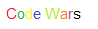

# CV - *Denis Tsurtsylin*
## deniszmail@gmail.com
## nickname on the rs school discord server - denisTS(nutristar)

### link to my Codewars - 

### link to my github - 

## Familiar with technologies:
### - Python(Django, Selenium, Pandas, Numpy, etc.)
### - SQL, SQLLite
### - AWS
### - GIT
### - Automation Anywhere

## other knowledge skills
- English language B1 
(I sold technological equipment, constantly communicated with the Danes in English. Accompanied delegations.)
- Polish B1
- Spanish, German A2
## hobby interests
 - playing guitar
 - snowboarding, kiteboarding, wakeboarding